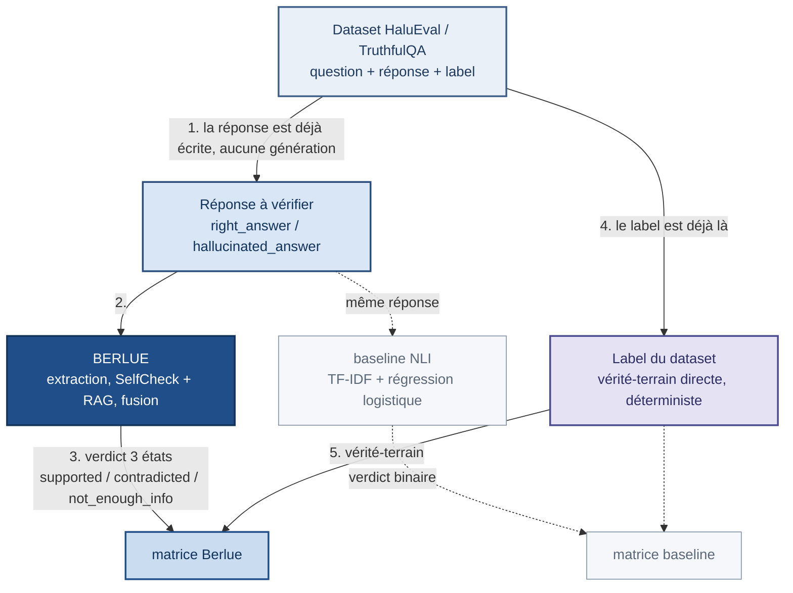
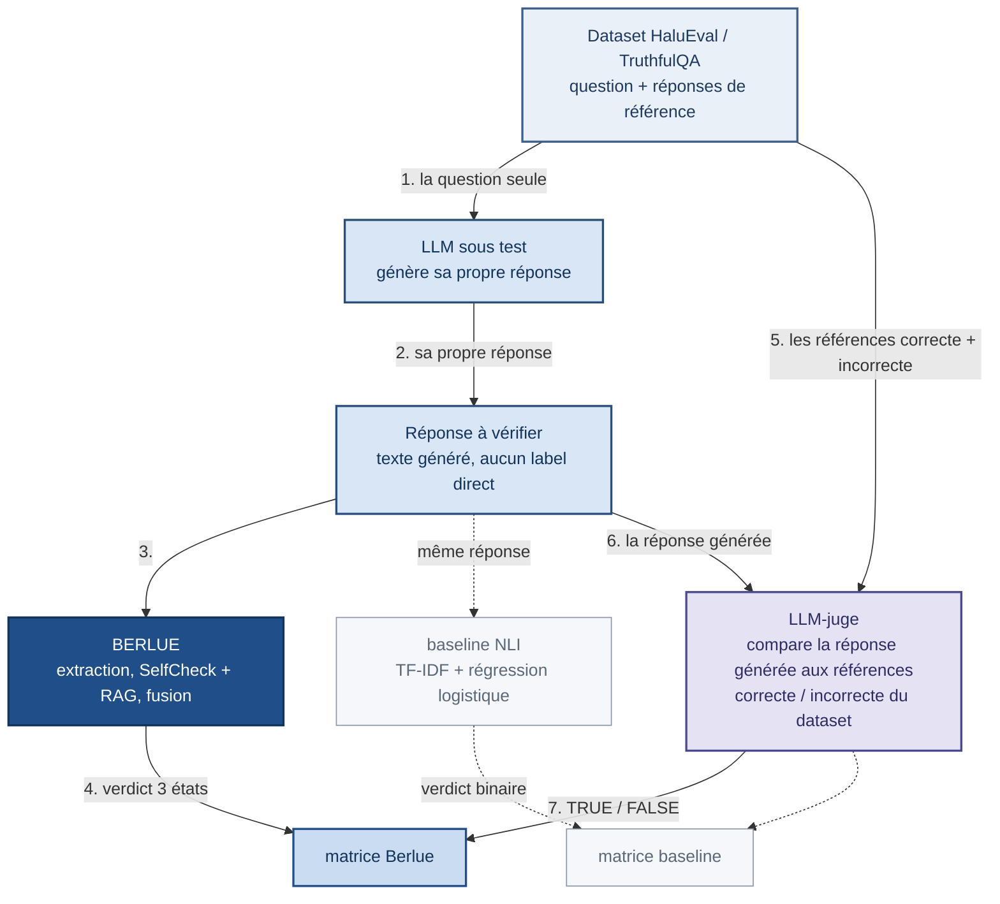

# Les deux modes d'évaluation

Berlue vérifie une réponse à une question — mais cette réponse peut être
**celle du dataset** (vérité-terrain connue, prête à l'emploi) ou **celle
que le LLM sous test vient de générer** (aucun label direct). Les deux
situations mesurent des choses différentes, d'où deux modes coexistants
plutôt qu'un seul.

Les deux schémas plus bas ont le **même squelette** : seules deux cases
changent — d'où vient la réponse vérifiée, et d'où vient la vérité-terrain.
Dans les deux, le bleu foncé est le chemin Berlue, le gris pointillé la
baseline NLI (point de comparaison, chemin totalement séparé, confrontée à la
même vérité-terrain), l'indigo la vérité-terrain elle-même. Le cache des
résultats n'y figure pas : c'est une optimisation d'exécution, pas une
propriété de la méthode (cf. [`storage.md`](storage.md)). Une version des deux
schémas côte à côte, éditable :
[`eval-modes.drawio`](eval-modes.drawio) (à ouvrir dans
[draw.io](https://app.diagrams.net)).

## Pourquoi deux modes

`HurluBerlu` vérifie une réponse via SelfCheckGPT : il rééchantillonne le
LLM sur la **question** et compare les affirmations de la réponse à ces
échantillons indépendants — l'échantillonnage (`generate_samples`) ne
dépend que de la question, jamais de la réponse fournie. Berlue peut donc
mécaniquement vérifier n'importe quelle réponse à une question, y compris
une réponse qu'il n'a pas lui-même générée — ce qui rend le mode dataset
valide, pas un détournement de la méthode.

Mais ça laisse un angle mort : vérifier la réponse figée du dataset ne dit
rien de la qualité de **génération** propre du LLM sous test. D'où le
second mode, qui fait générer sa propre réponse au LLM et la fait vérifier.

## Mode dataset

Berlue vérifie la réponse **du dataset** (`right_answer`/`hallucinated_answer`
HaluEval, ou les variantes `Correct`/`Incorrect Answers` TruthfulQA) —
`evaluate_model`/`evaluate_model_matrix` (`berlue.evaluation.run_eval`).

- Mesure la capacité de jugement de **Berlue seul** — le LLM interne
  n'intervient que comme outil (échantillonnage SelfCheck, extraction), la
  variable mesurée reste Berlue.
- Vérité-terrain = `ground_truth_label` du dataset, directement — fiable,
  déterministe, pas de vérité-terrain de substitution nécessaire.
- Méthodologie standard pour ce type de benchmark (tâche de discrimination
  sur HaluEval/TruthfulQA).
- N'évalue pas la qualité de génération propre du LLM — seulement sa
  capacité, via Berlue, à juger un texte donné.

Chaque exemple produit un verdict `SUPPORTED`/`CONTRADICTED`/
`NOT_ENOUGH_INFO`, réduit depuis les verdicts par affirmation de la réponse
(`aggregate_verdict`) : une seule affirmation contredite suffit à classer
toute la réponse `CONTRADICTED` (pire cas), sinon une seule incertaine
suffit à la classer `NOT_ENOUGH_INFO`.

## Mode généré + juge

Même squelette que le mode dataset ; les deux seules différences sont
l'étape 2 (d'où vient la réponse vérifiée) et les étapes 5 à 7 (d'où vient
la vérité-terrain).

Le LLM sous test génère sa propre réponse à la question ; un **LLM-juge**
détermine la vérité-terrain de cette réponse générée, en la comparant aux
réponses de référence du dataset. Berlue et la baseline NLI la vérifient
tous les deux, mais par deux chemins **totalement séparés**, chacun avec son
propre remplissage de cache et sa propre matrice — aucun des deux ne
calcule ni ne stocke rien pour l'autre (même principe qu'en mode dataset,
où `evaluate_model` et `evaluate_baseline` ne se mélangent jamais) :

- Berlue : `evaluate_model_generated` (génération + fact-check Berlue +
  juge) puis `evaluate_model_generated_matrix` (Berlue-vs-juge).
- Baseline : `evaluate_baseline_generated` (classifie la réponse déjà
  générée par `evaluate_model_generated` — jamais regénérée) puis
  `evaluate_baseline_generated_matrix` (baseline-vs-juge, reuse le verdict
  du juge déjà en cache).

- Mesure le système combiné **génération + détection** en conditions plus
  proches d'un usage produit réel — qualité de génération et qualité de
  détection mélangées dans un seul chiffre.
- Résout le problème de vérité-terrain d'une réponse générée à la volée
  (aucun label direct) via un jugement **ancré sur les références du
  dataset** plutôt qu'une correspondance de texte exacte.

### Le LLM-juge

Compare la réponse générée à une référence correcte et une référence
incorrecte tirées du dataset (`berlue.evaluation.judge`) :

- Décision **binaire** (TRUE/FALSE, pas d'incertain) — le juge joue un rôle
  de vérité-terrain de substitution, pas de détecteur ; une vérité-terrain
  incertaine ne sert à rien (même choix que la baseline NLI, qui n'émet
  jamais `NOT_ENOUGH_INFO` non plus).
- Ordre de présentation des deux références **randomisé** à chaque appel,
  pour éviter un biais de position — les étiquettes CORRECT/INCORRECT
  restent toujours attachées à leur contenu.
- Prompt en anglais (le dataset l'est), chaque champ entouré de guillemets
  — une référence correcte très courte (fréquent, ex. une réponse en un
  mot) juxtaposée à une référence incorrecte reformulée en phrase complète
  peut sinon donner l'impression d'un champ tronqué plutôt que d'une valeur
  délibérément courte.
- Seule la première ligne de la réponse est parsée — un modèle qui ignore
  la consigne "un seul mot" peut continuer à générer après sa réponse ;
  chercher TRUE sur tout le texte risquerait d'inverser un FALSE réellement
  répondu en premier mot.
- Modèle dédié et fixe (`JUDGE_MODEL`), indépendant du modèle sous test —
  permet de comparer plusieurs modèles à juge constant, sans confondre "le
  modèle génère mieux" avec "le juge a un biais différent ce jour-là".
  Comparaison de tailles de modèle pour ce rôle : voir
  [`model-comparison-notes.md`](model-comparison-notes.md).

### Ce qui est réel vs mocké aujourd'hui

Génération, fact-check Berlue et jugement sont tous de vrais appels LLM par
défaut (`generator_client`/`judge_client`, de vrais `OllamaClient`, et
`pipeline.predict` sur `HurluBerlu` via `BerluePipeline`) — un composant
mocké ne mesurerait rien de réel. `RandomBerluePipeline` (verdicts
aléatoires) reste disponible pour développer/tester la boucle d'éval sans
dépendre d'Ollama ni d'un index FAISS, mais n'est plus branché par défaut.

## Comparaison

| | Mode dataset | Mode généré + juge |
|---|---|---|
| Réponse vérifiée | Celle du dataset | Générée par le LLM sous test |
| Mesure | Berlue seul | Génération + détection combinées |
| Vérité-terrain | Label du dataset | Jugement LLM ancré sur les références |
| Coût | K échantillons/claim | + génération + jugement par question |
